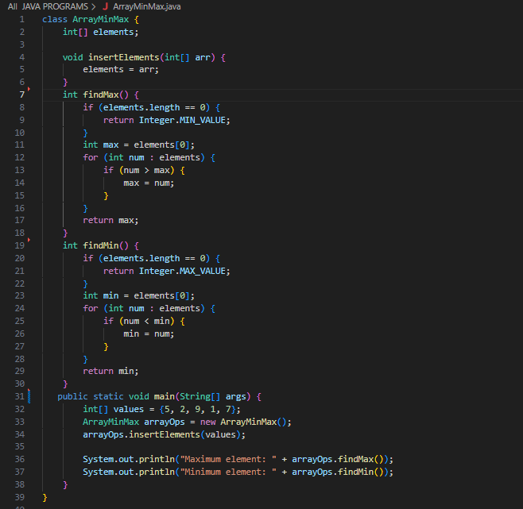

# Java Programming Repository

Welcome to my Java programming repository! This repository contains a collection of simple and basic Java programs to help you learn and practice Java programming concepts.

## Table of Contents
- [Java Programming Repository](#java-programming-repository)
  - [Table of Contents](#table-of-contents)
  - [Introduction to Java](#introduction-to-java)
  - [Programs](#programs)
  - [Getting Started](#getting-started)
  - [Contributing](#contributing)
  - [Screenshots](#screenshots)

## Introduction to Java

Java is a high-level, object-oriented programming language widely used for developing robust and scalable applications. It offers a platform-independent environment, thanks to its "write once, run anywhere" philosophy. This repository aims to provide a hands-on experience with Java programming through simple and beginner-friendly examples.

## Programs

Here are some of the Java programs included in this repository:

1. [Array](./All%20%20JAVA%20PROGRAMS/Array.java): The classic introductory program of Array.

2. [Array Min Max](./All%20%20JAVA%20PROGRAMS/ArrayMinMax.java): Simple program to find the Smallest  and largest Array Elements .

3. [Array Sum And Avg](./All%20%20JAVA%20PROGRAMS/ArraySumAvg.java): Simple program to Add the Array Elements and find it's Average.
  
4.  [Calculator](./All%20%20JAVA%20PROGRAMS/Calculator.java): A basic calculator program that demonstrates arithmetic operations.
  
5.  [Array Sum And Avg](./All%20%20JAVA%20PROGRAMS/Fibonacci.java): Generates and prints the Fibonacci series up to a specified term.

## Getting Started

To run these Java programs on your machine, follow these steps:

1. Ensure you have [Java Development Kit (JDK)](https://www.oracle.com/java/technologies/javase-downloads.html) installed.
2. Clone this repository: `git clone https://github.com/PRANAYRAJPUT321/java-programming-repo.git`
3. Navigate to the `src` directory: `cd java-programming-repo/src`
4. Compile a program: `javac ProgramName.java` (replace `ProgramName` with the desired program's filename)
5. Run the compiled program: `java ProgramName` (without the `.java` extension)

## Contributing

Contributions are welcome! If you'd like to add more programs or improve existing ones, follow these steps:

1. Fork this repository.
2. Create a new branch: `git checkout -b feature/new-program`
3. Make your changes and commit them: `git commit -m "Add a new program"`
4. Push to the branch: `git push origin feature/new-program`
5. Open a pull request.

## Screenshots

Here are some screenshots of the Java programs in action:

;
;

Feel free to reach out if you have any questions or suggestions.

Happy coding!
